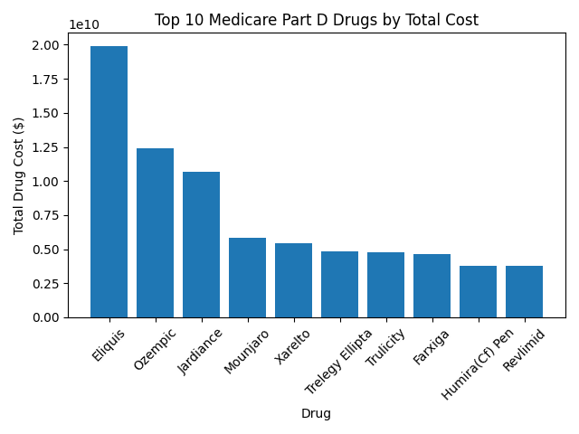
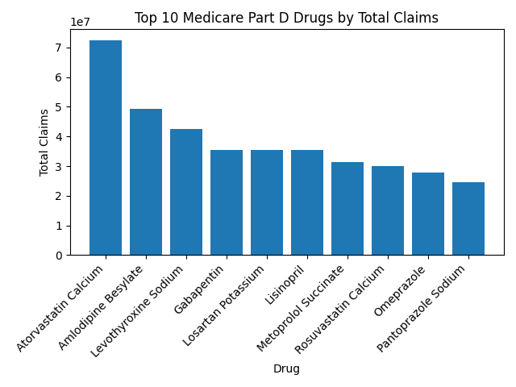
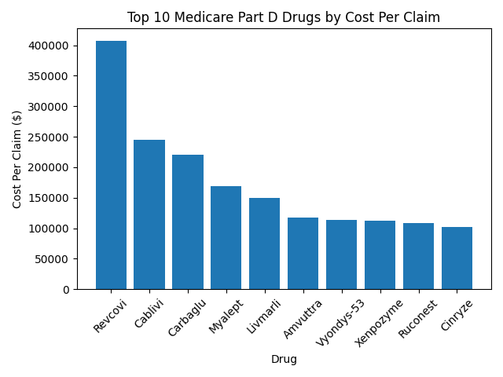

# Medicare Part D Drug Spending Analysis

## Project Overview

This project analyzes Medicare Part D prescription drug data using Python to identify patterns in drug spending and prescription claims.

The analysis processes a large Medicare dataset in chunks, summarizes the data by drug, and identifies drugs with the highest:

- Total drug cost
- Total number of claims
- Cost per claim

## Tools Used

- Python
- Pandas
- Matplotlib
- PyCharm
- Git/GitHub

## Dataset

The project uses Medicare Part D prescription drug data.

Data source: [Centers for Medicare & Medicaid Services (CMS) – Medicare Part D Prescribers by Provider and Drug](https://data.cms.gov/provider-summary-by-type-of-service/medicare-part-d-prescribers/medicare-part-d-prescribers-by-provider-and-drug)

Because the original dataset is large, Python processes the data in chunks and creates a smaller summarized dataset containing:

- Drug name
- Total drug cost
- Total claims
- Cost per claim

The final summarized dataset contains 3,055 drugs.

## Key Findings

### Top Drugs by Total Cost

Eliquis had the highest total Medicare Part D drug spending in the dataset, followed by Ozempic and Jardiance.

### Top Drugs by Total Claims

Atorvastatin Calcium had the highest number of claims, followed by Amlodipine Besylate and Levothyroxine Sodium.

### Top Drugs by Cost Per Claim

Revcovi had the highest cost per claim at approximately $407,000 per claim.

## Project Structure

- `src/explore_data.py` - Initial dataset exploration
- `src/analyze_full_data.py` - Processes the full dataset and creates the summarized data
- `src/analyze_summary.py` - Analyzes the summarized dataset and creates visualizations
- `data/drug_summary.csv` - Summarized drug level dataset
- `images/` - Generated visualizations

## Skills Demonstrated

This project demonstrates:

- Working with large datasets
- Data cleaning and aggregation
- Chunk based data processing
- Data analysis with Pandas
- Calculating analytical metrics
- Sorting and ranking data
- Data visualization with Matplotlib
- Organizing a Python data analytics project